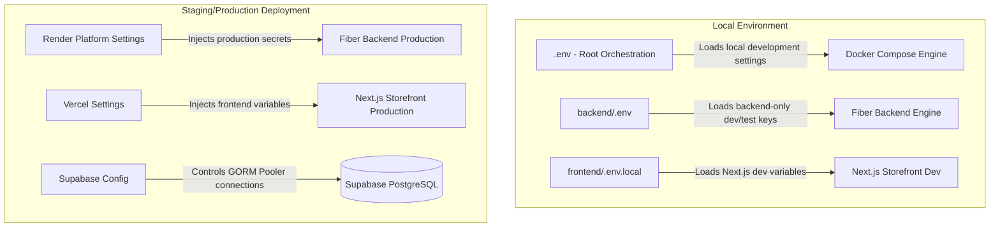

# Kloset Production Environment Hardening Report
**Startup-Grade Production Environment Configuration**

---

## 1. Required Variables

These variables are critical for core application runtime and must be populated in all environments (Development, Staging, and Production).

* **Core Application:**
  * `APP_NAME`: Name of the platform (default: `Kloset`).
  * `APP_ENV`: Deployment stage (`development`, `staging`, or `production`).
  * `APP_PORT`: Server listener port (typically `8080`).
  * `APP_URL`: API gateway base URL.
  * `FRONTEND_URL`: URL of the storefront application.
* **Database (PostgreSQL / Supabase):**
  * `DB_HOST`, `DB_PORT`, `DB_USER`, `DB_PASSWORD`, `DB_NAME`: Credentials and endpoints for Supabase.
  * `DB_SSLMODE`: Database SSL status (must be `require` in production).
* **JWT Access Controls:**
  * `JWT_SECRET`: Signing key for API tokens (must be cryptographically secure in production).
  * `JWT_ACCESS_EXPIRY`, `JWT_REFRESH_EXPIRY`: Durations for access and refresh token expiries.
* **Asset Uploads (Cloudinary):**
  * `CLOUDINARY_CLOUD_NAME`, `CLOUDINARY_API_KEY`, `CLOUDINARY_API_SECRET`: Credentials to access the Cloudinary SDK.
* **Payment Gateways (Razorpay):**
  * `RAZORPAY_KEY_ID`, `RAZORPAY_KEY_SECRET`, `RAZORPAY_WEBHOOK_SECRET`: Active live or test keys.
* **Email Notification Dispatch (Resend):**
  * `RESEND_API_KEY`, `RESEND_FROM_EMAIL`, `RESEND_FROM_NAME`: Keys and verified sender domains.
* **AI Engine & Analysis (Gemini):**
  * `GEMINI_API_KEY`, `GEMINI_MODEL`: Gemini API key and active engine model.
* **Google Identity Security (OAuth):**
  * `GOOGLE_CLIENT_ID`: Google Client ID for server validation.
* **Platform Constants:**
  * `PLATFORM_FEE_PERCENT`, `MAX_IMAGES_PER_OUTFIT`, `BOOKING_ACCEPT_WINDOW_HOURS`, `SECURITY_DEPOSIT_REFUND_DAYS`: Dynamic variables controlling operational business logic.
* **Next.js Storefront Front-facing Keys:**
  * `NEXT_PUBLIC_API_URL`: Root path of the API backend.
  * `NEXT_PUBLIC_CLOUDINARY_CLOUD_NAME`, `NEXT_PUBLIC_CLOUDINARY_UPLOAD_PRESET`: Public credentials to manage and store renter image uploads.
  * `NEXT_PUBLIC_RAZORPAY_KEY_ID`: Initiator code for Razorpay overlay checkout.
  * `NEXT_PUBLIC_GOOGLE_CLIENT_ID`: Required client-side identifier for Google auth initialization.

---

## 2. Recommended Variables

These variables are recommended to set up structured logging, telemetry, crash reporting, and analytics in a production configuration.

* **Structured Logging & CORS:**
  * `LOG_LEVEL`: Configures standard backend verbosity (typically `warn` in production, `info` or `debug` in dev/staging).
  * `ALLOWED_ORIGINS`: Comma-separated list of browser domains allowed to access backend Fiber API resources to prevent unauthorized cross-origin requests.
* **Crash & Error Tracking (Sentry):**
  * `SENTRY_DSN`: Backend Sentry telemetry tracking.
  * `NEXT_PUBLIC_SENTRY_DSN`: Frontend React Sentry client tracking.
* **User Analytics (PostHog):**
  * `NEXT_PUBLIC_POSTHOG_KEY`: Public token to push frontend client events.
  * `NEXT_PUBLIC_POSTHOG_HOST`: Targeting Host (e.g., `https://us.i.posthog.com`).

---

## 3. Future Variables

These variables prepare Kloset for deployment scaling, CDN firewalls, orchestration, and automated status webhooks without requiring future config refactoring:

* **PaaS Deployment Auto-Mappings:**
  * `RENDER_EXTERNAL_URL`: Auto-defined endpoint by Render representing the routing path.
  * `VERCEL_ENV`: Environment flag auto-injected by Vercel (`production`, `preview`, `development`).
* **DNS Shielding & Firewall (Cloudflare):**
  * `CLOUDFLARE_ZONE_ID`: Specific zone code of the domain route in Cloudflare.
  * `CLOUDFLARE_API_TOKEN`: Access token to programmatically manage Cloudflare rules or purge CDN cache.
* **Operational Alerts (Webhooks):**
  * `SLACK_WEBHOOK_URL` / `DISCORD_WEBHOOK_URL`: Integrated endpoints for instant Slack or Discord channel alerts (e.g., failed payouts, user disputes).
  * `UPTIME_WEBHOOK_URL`: Uptime monitor heartbeat link triggered by the backend's health checks.

---

## 4. Variables Removed

The following unused/stale placeholders identified during security audits have been safely removed:

* `NEXT_PUBLIC_GOOGLE_MAPS_API_KEY`: Verified to have zero code dependencies.
* `NEXT_PUBLIC_APP_URL`: Replaced by standard Next.js settings and direct environment checks.
* `GOOGLE_CLIENT_SECRET`: Removed from active files as it is unused by the backend ID token validation flow.

---

## 5. Final Environment Architecture

The example templates have been fully written and aligned:
* [backend/.env.example](file:///y:/swetha/Kloset/backend/.env.example) (contains all backend required, optional, deployment, security, and webhook variables).
* [frontend/.env.example](file:///y:/swetha/Kloset/frontend/.env.example) (contains all Next.js frontend variables, telemetry keys, and Vercel flags).
* [production.env.example](file:///y:/swetha/Kloset/production.env.example) (unified master blueprint outlining the entire production deployment variable ecosystem).
