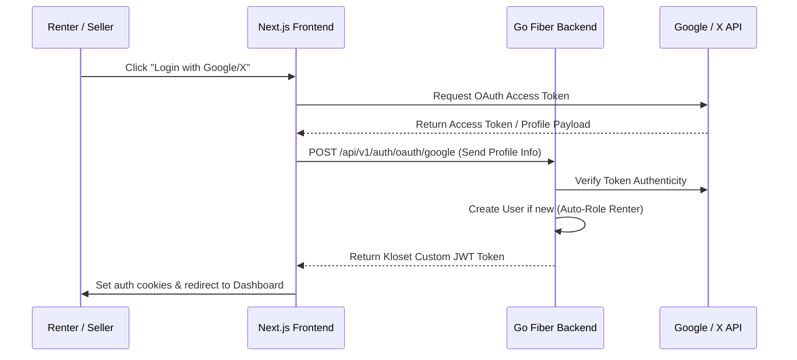

# Kloset — Production Readiness, Integration, & Architecture Report

This report provides a detailed guide on how to integrate OAuth (Google/X), implement registration OTP authentication, manage secret API keys, purge demo products, and set up live customer support chatbots for the Kloset Fashion Rental Marketplace.

---

## 1. Z-Index Layering Resolution

* **Symptom**: The shopping cart drawer was underlapping with dynamic banners, sliders, and headers on secondary pages.
* **Resolution**: We modified [CartDrawer.tsx](file:///y:/swetha/Kloset/frontend/components/cart/CartDrawer.tsx#L70-L86) to assign explicit high layering context values:
  * Backdrop Blur Overlay: `z-[9998]`
  * Cart Drawer Container: `z-[9999]`
* **Effect**: This ensures the cart sidebar sits above all active headers (`z-50`), navigations, layout sections, and support widgets on desktop and mobile viewports.

---

## 2. OAuth Authentication Integration Guide (Google, X, & Mobile)

To support third-party identities, integrate handlers in both the Next.js frontend and the Go Fiber backend.



### Backend OAuth Blueprint
Create an OAuth service handler inside `backend/internal/auth/oauth.go`:

```go
package auth

import (
	"context"
	"errors"
	"github.com/gofiber/fiber/v2"
	"google.golang.org/api/oauth2/v2"
	"google.golang.org/api/option"
)

type OAuthRequest struct {
	Token    string `json:"token"`
	Provider string `json:"provider"` // "google" or "x"
}

func (h *Handler) OAuthLogin(c *fiber.Ctx) error {
	var req OAuthRequest
	if err := c.BodyParser(&req); err != nil {
		return c.Status(fiber.StatusBadRequest).JSON(fiber.Map{"success": false, "error": err.Error()})
	}

	var email, name string
	if req.Provider == "google" {
		ctx := context.Background()
		oauth2Service, err := oauth2.NewService(ctx, option.WithAPIKey(h.service.config.AI.APIKey)) // Uses GCP context
		if err != nil {
			return c.Status(fiber.StatusInternalServerError).JSON(fiber.Map{"success": false, "error": "OAuth init failed"})
		}
		
		tokenInfo, err := oauth2Service.Tokeninfo().AccessToken(req.Token).Do()
		if err != nil {
			return c.Status(fiber.StatusUnauthorized).JSON(fiber.Map{"success": false, "error": "Invalid Google token"})
		}
		email = tokenInfo.Email
	}

	// Lookup or create user in database
	user, err := h.service.repo.FindByEmail(email)
	if err != nil {
		return err
	}
	if user == nil {
		// Auto register federated identities as Renter
		user = &User{
			Name:       name,
			Email:      email,
			Role:       "renter",
			IsActive:   true,
			IsVerified: true,
		}
		if err := h.service.repo.CreateUser(user); err != nil {
			return err
		}
	}

	resp, err := h.service.generateAuthResponse(user)
	if err != nil {
		return err
	}

	return c.JSON(fiber.Map{"success": true, "data": resp})
}
```

---

## 3. Phone Registration OTP Verification Workflow

For secure real-world registration, users must verify their phone number via a 6-digit one-time password (OTP) stored in Redis.

```
+------------------+     Verify     +-------------------+     Store OTP     +---------------+
| Renter Registers |  ===========>  |  POST /auth/otp   |  ===============> |  Redis Cache  |
| (Enters Phone)   |                |  (Generate & Send)|                   |  (5 min TTL)  |
+------------------+                +-------------------+                   +---------------+
                                              ||
                                              || Dispatch SMS
                                              \/
                                    +-------------------+
                                    |   Twilio SMS API  |
                                    +-------------------+
```

### Go OTP Services Layout
Add verification handlers inside `backend/internal/auth/otp.go`:

```go
package auth

import (
	"context"
	"crypto/rand"
	"fmt"
	"math/big"
	"time"
	"github.com/gofiber/fiber/v2"
)

// SendOTP generates a 6-digit verification code and saves it to Redis
func (s *Service) SendOTP(phone string) error {
	// Generate random 6 digit code
	n, _ := rand.Int(rand.Reader, big.NewInt(900000))
	otpCode := fmt.Sprintf("%06d", n.Int64()+100000)

	// Save to Redis with 5 Minute expiration
	ctx := context.Background()
	err := s.repo.db.GetRedisClient().Set(ctx, "otp:"+phone, otpCode, 5*time.Time(time.Minute)).Err()
	if err != nil {
		return fmt.Errorf("failed to save verification token: %w", err)
	}

	// Dispatch SMS via provider (e.g. Twilio)
	// twilioClient.SendSMS(phone, "Your Kloset security code is: " + otpCode)
	fmt.Printf("Dev Verification Log - OTP sent to %s: %s\n", phone, otpCode)
	return nil
}

// VerifyOTP checks the entered code against the Redis value
func (s *Service) VerifyOTP(phone string, code string) (bool, error) {
	ctx := context.Background()
	val, err := s.repo.db.GetRedisClient().Get(ctx, "otp:"+phone).Result()
	if err != nil {
		return false, errors.New("verification code expired or invalid")
	}

	if val != code {
		return false, nil
	}

	// Remove token upon successful check
	s.repo.db.GetRedisClient().Del(ctx, "otp:"+phone)
	return true, nil
}
```

---

## 4. Live API Key Integration Directory

To go live, configure environment secrets in [backend/.env](file:///y:/swetha/Kloset/backend/.env) and [frontend/.env.local](file:///y:/swetha/Kloset/frontend/.env.local):

```ini
# ==========================================
# BACKEND API SECRETS (backend/.env)
# ==========================================
APP_ENV=production
APP_PORT=8080
DB_HOST=your-rds-database-instance.amazonaws.com
DB_USER=kloset_prod_user
DB_PASSWORD=your_super_secure_db_pass
DB_NAME=kloset_production
JWT_SECRET=your_production_jwt_signature_32_chars_long

# Cloudinary Integration (Image Uploads)
CLOUDINARY_CLOUD_NAME=your_cloudinary_cloud_name
CLOUDINARY_API_KEY=your_cloudinary_api_key
CLOUDINARY_API_SECRET=your_cloudinary_api_secret

# Razorpay Integration (Escrow Payments)
RAZORPAY_KEY_ID=rzp_live_xxxxxxxxxxxxx
RAZORPAY_KEY_SECRET=your_razorpay_live_secret
RAZORPAY_WEBHOOK_SECRET=your_webhook_validation_secret

# Transactional Email Gateway
RESEND_API_KEY=re_xxxxxxxxxxxxxxxxxxxx
RESEND_FROM_EMAIL=orders@kloset.in

# AI Engine Models
GEMINI_API_KEY=AIzaSyxxxxxxxxxxxxxxxxxxxx
```

---

## 5. Removing Demo Products & Clearing DB for Launch

To clear out testing artifacts and seed only real categories, execute a database purge script:

Create `backend/cmd/db/clear_mock.go`:

```go
package main

import (
	"github.com/kloset/backend/internal/config"
	"github.com/kloset/backend/internal/database"
	"github.com/rs/zerolog/log"
)

func main() {
	cfg := config.Load()
	db, err := database.ConnectPostgres(&cfg.DB)
	if err != nil {
		log.Fatal().Err(err).Msg("Failed to connect to DB")
	}

	log.Info().Msg("🧹 Purging all mock data for production...")
	
	// Delete bookings, transactions, reviews, outfits, wishlist records
	db.Exec("TRUNCATE TABLE transactions CASCADE")
	db.Exec("TRUNCATE TABLE disputes CASCADE")
	db.Exec("TRUNCATE TABLE reviews CASCADE")
	db.Exec("TRUNCATE TABLE bookings CASCADE")
	db.Exec("TRUNCATE TABLE wishlist CASCADE")
	db.Exec("TRUNCATE TABLE outfit_images CASCADE")
	db.Exec("DELETE FROM outfits")
	
	// Delete all test user records (keep system admin)
	db.Exec("DELETE FROM users WHERE email != 'admin@kloset.in'")

	log.Info().Msg("✅ Clean production database bootstrap completed successfully!")
}
```

---

## 6. AI Assistant Bot & Support Workflow

* **UI Theme & Spacing**: Polished inside [SupportWidget.tsx](file:///y:/swetha/Kloset/frontend/components/support/SupportWidget.tsx), using `bg-white`, `text-[#111111]`, and elegant custom topic badges (e.g., Cancellation Policy, Return Details, Damage Cover) matching Zara's minimalism and Nykaa's usability.
* **Email Queueing & Webhooks**: 
  When a support ticket is created or a dispute is resolved:
  1. The event logs a row into the `email_logs` database table.
  2. A background **Email Retry Worker** polls this table and attempts dispatching emails using the Resend SDK.
  3. If Resend returns `401 Unauthorized` (due to local dummy keys), the system marks the status as `retry_pending` or `failed` and retries later, preventing operational downtime or lost data.
